# examples

## subgraph label spacing

from https://github.com/mermaid-js/mermaid/issues/1209

### original

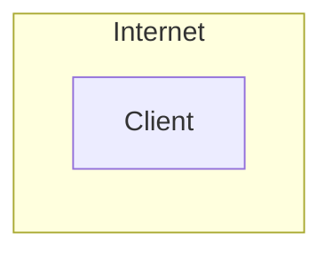

### patern 1

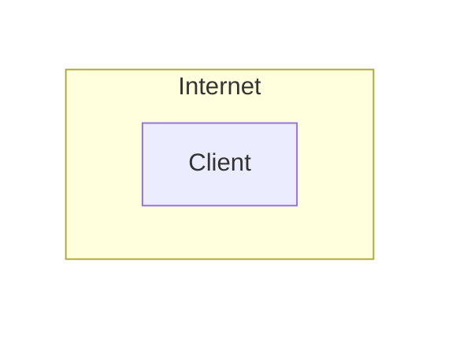

### patern 2

## escape

from https://stackoverflow.com/questions/28121525/mermaid-cli-how-do-you-escape-characters

`a---b---other`

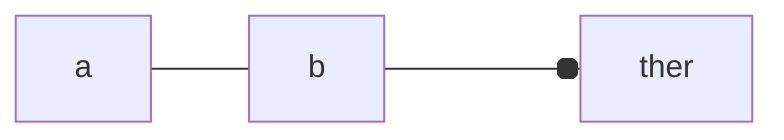

`a---b--- other`

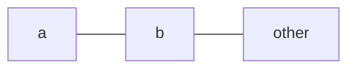

`a---b---dummy["other"]`

## tree style

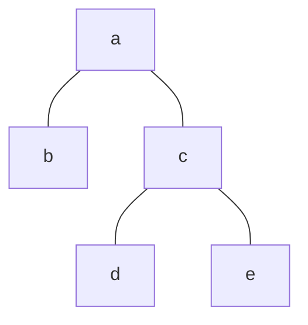

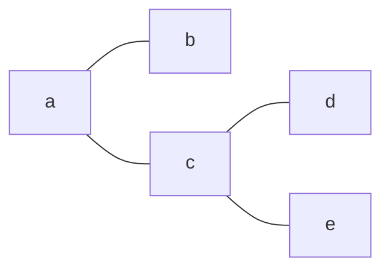

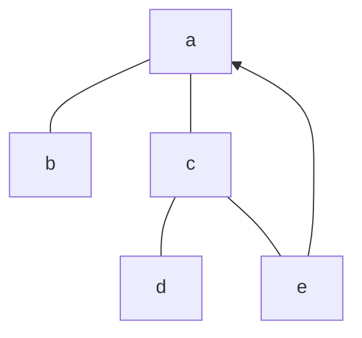

## classDiagram

from https://mermaid-js.github.io/mermaid/#/classDiagram

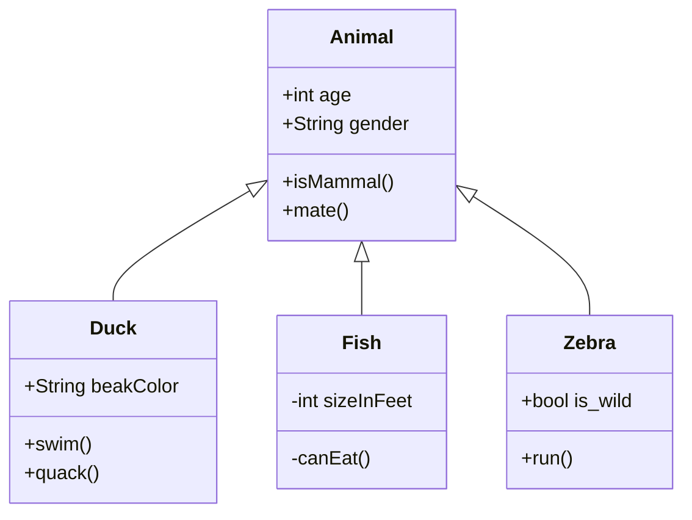

## sequenceDiagram

from https://mermaid-js.github.io/mermaid/#/sequenceDiagram?id=sequencenumbers

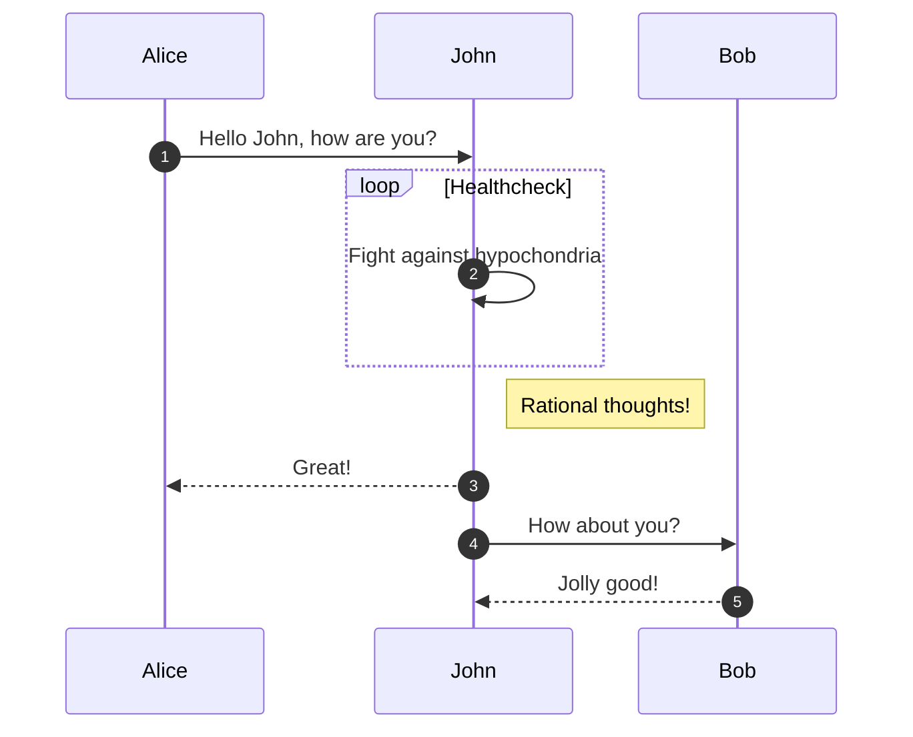

## entityRelationshipDiagram

from https://mermaid-js.github.io/mermaid/#/entityRelationshipDiagram?id=attributes

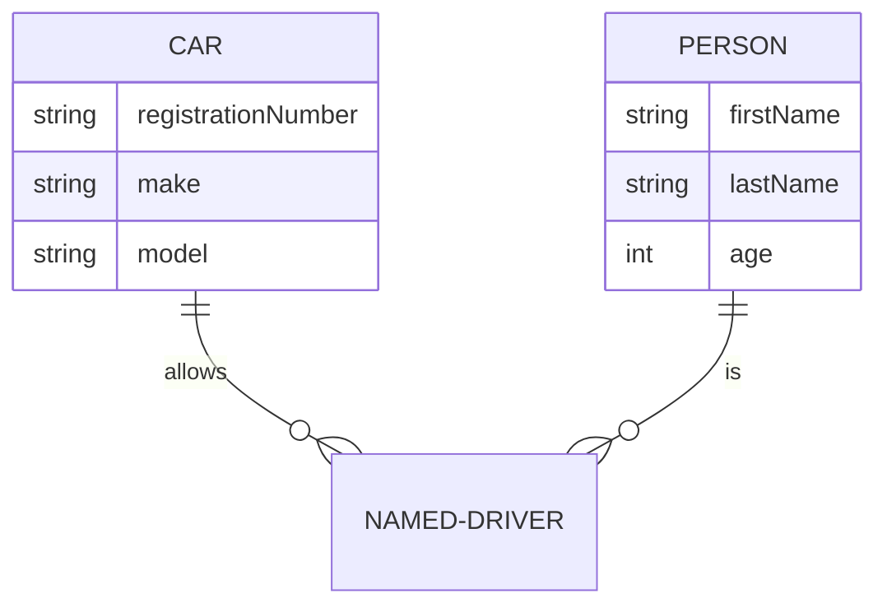

## pie

from https://mermaid-js.github.io/mermaid/#/pie?id=example

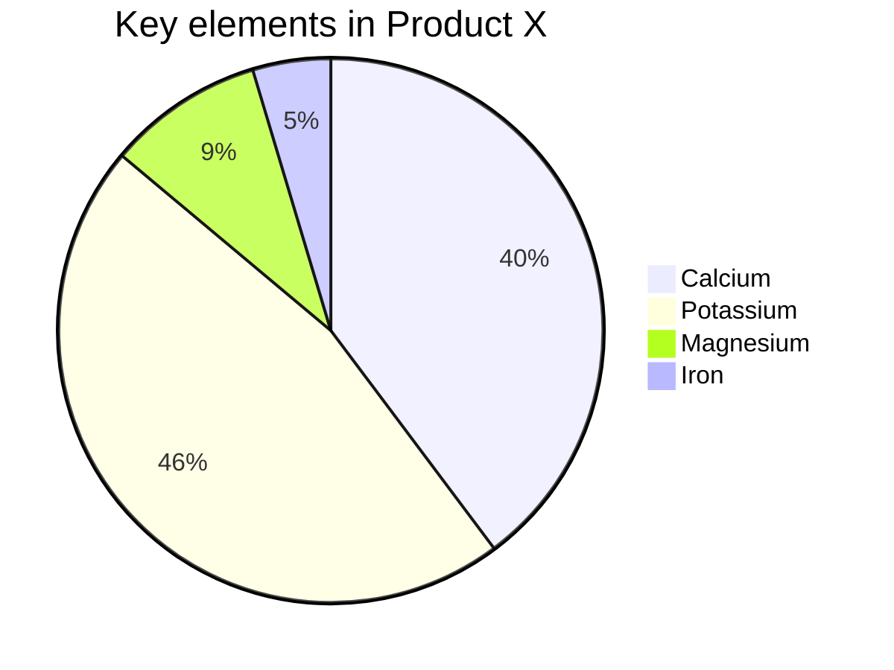